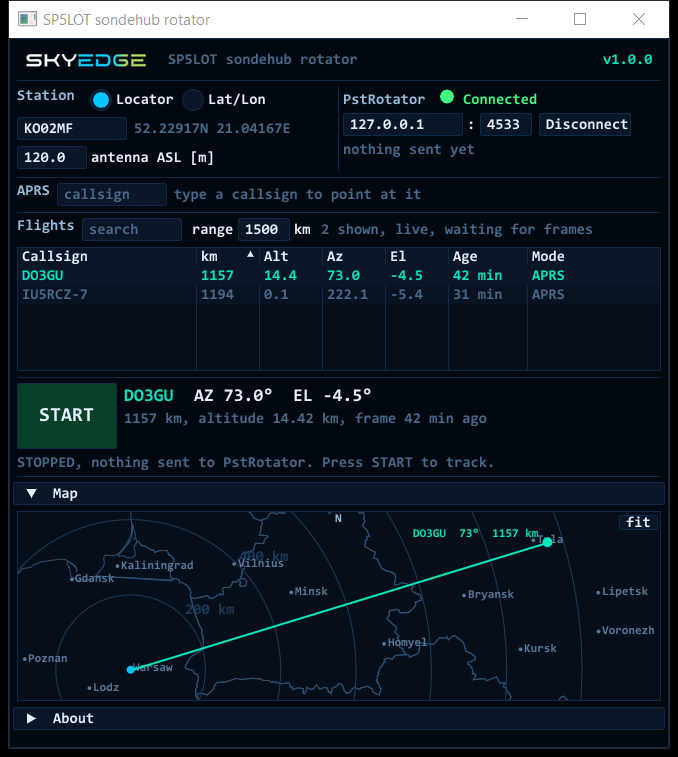

# SP5LOT sondehub rotator (SkyEdge)

**[English](#english) | [Polski](#polski)**

---

## English

A small Windows program that **points your antenna rotator at a high-altitude balloon**.
It takes live balloon positions from **SondeHub Amateur** (or follows any **APRS callsign** you type)
and sends azimuth and elevation to **PstRotator**, which drives your rotator.

### Download

Get the ZIP from **[Releases](../../releases/latest)**. It is one `.exe`, no installer.

### You need

- Windows 10 or 11, 64-bit (tested on Windows 10), with a normal graphics driver (OpenGL).
  In some remote desktop sessions or virtual machines the window may not open.
- **PstRotator** (by YO3DMU) set up for your rotator.
- An internet connection.

### PstRotator setup (once)

1. In PstRotator open the **Tracker** menu and tick **Gpredict**.
   This opens TCP port **4533**. Gpredict itself is not needed, it is only the name of the option.
2. Only if PstRotator runs on **another PC**: allow incoming TCP port 4533 in the Windows firewall on that PC.

### Quick start

1. Extract the ZIP into a folder where you can write (for example on the Desktop) and run `sondehub_rotator.exe`.
   The program is not signed, so Windows may show *"Windows protected your PC"*: click *More info*, then *Run anyway*.
2. **Station**: type your **locator** (6 to 10 characters, 10 is the most precise) or choose *Lat/Lon* and type the coordinates.
   Enter the **antenna height above sea level** in metres (ground height + mast).
3. **PstRotator**: host `127.0.0.1` if PstRotator runs on the same PC (otherwise the IP address of that PC), port `4533`,
   then click **Connect**. The lamp turns green: *Connected*.
   If it does not connect: start PstRotator first and check that *Tracker > Gpredict* is ticked.
4. **Choose a target**: click a balloon in the list, or type an **APRS callsign** with its SSID (for example `AB1CDE-11`)
   in the *APRS* field.
5. Press **START**. The rotator follows the target. When the target is below the horizon, the antenna follows the azimuth
   and the elevation stays at 0. **STOP** stops sending commands.
   If the rotator does not move although commands are sent, switch PstRotator to *Tracking* mode.

### Good to know

- **Flights list**: SondeHub Amateur balloons transmitting on 144 MHz and above, within the **range** you set (default 500 km).
  WSPR (HF) balloons are not listed. A selected balloon that moves out of range is deselected.
- **APRS callsign**: the antenna goes to the last known position of that station at once and then follows new positions.
  Without altitude in the packet, only the azimuth is followed.
- **Map**: drag with the mouse to move, use the mouse wheel to zoom, **fit** (or a double click) shows the station and the target.
- **GPS alarm**: if a balloon's position suddenly jumps (possible GPS interference or bad data), its row turns red (*SPOOFING?*)
  and the rotator stays on the last good position. **accept** takes the new position.
- Settings are saved in `sondehub_rotator.ini` next to the exe.
- The program only reads data: it never uploads your position or any packets to SondeHub or to the APRS network.

### Data and licence

Balloon data: [SondeHub](https://sondehub.org) (live feed) and the APRS network. Freeware, see [LICENSE.txt](LICENSE.txt).
Third-party components: [THIRD_PARTY.txt](THIRD_PARTY.txt).

---

## Polski

Mały program na Windows, który **kieruje rotor anteny na balon stratosferyczny**.
Bierze bieżące pozycje balonów z **SondeHub Amateur** (albo śledzi dowolny wpisany **znak APRS**)
i wysyła azymut i elewację do **PstRotatora**, który steruje rotorem.

### Pobieranie

Plik ZIP jest w **[Releases](../../releases/latest)**. W środku jest jeden `.exe`, bez instalatora.

### Potrzebne

- Windows 10 albo 11, 64-bit (sprawdzone na Windows 10), ze zwykłym sterownikiem grafiki (OpenGL).
  W niektórych sesjach pulpitu zdalnego i maszynach wirtualnych okno może się nie otworzyć.
- **PstRotator** (YO3DMU) ustawiony dla Twojego rotora.
- Internet.

### Ustawienia PstRotatora (jednorazowo)

1. W PstRotatorze otwórz menu **Tracker** i zaznacz **Gpredict**.
   To otwiera port TCP **4533**. Sam program Gpredict nie jest potrzebny, to tylko nazwa opcji.
2. Tylko gdy PstRotator działa na **innym komputerze**: wpuść przychodzący port TCP 4533 w zaporze Windows na tamtym komputerze.

### Szybki start

1. Rozpakuj ZIP do folderu, w którym możesz zapisywać (np. na Pulpicie), i uruchom `sondehub_rotator.exe`.
   Program nie jest podpisany, więc Windows może pokazać *„System Windows ochronił ten komputer”*: kliknij *Więcej informacji*, potem *Uruchom mimo to*.
2. **Station (stacja)**: wpisz **lokator** (od 6 do 10 znaków, 10 jest najdokładniejszy) albo wybierz *Lat/Lon* i wpisz współrzędne.
   Wpisz **wysokość anteny nad poziomem morza** w metrach (wysokość terenu + maszt).
3. **PstRotator**: host `127.0.0.1`, gdy PstRotator działa na tym samym komputerze (inaczej adres IP tamtego komputera), port `4533`,
   potem kliknij **Connect**. Lampka zmieni się na zieloną: *Connected*.
   Jeśli nie łączy: najpierw uruchom PstRotator i sprawdź, czy *Tracker > Gpredict* jest zaznaczone.
4. **Wybierz cel**: kliknij balon na liście albo wpisz w polu *APRS* **znak APRS** z SSID (np. `AB1CDE-11`).
5. Naciśnij **START**. Rotor śledzi cel. Gdy cel jest pod horyzontem, antena idzie za azymutem, a elewacja zostaje na 0.
   **STOP** przestaje wysyłać komendy.
   Jeśli komendy idą, a rotor się nie rusza, przełącz PstRotator w tryb *Tracking*.

### Dobrze wiedzieć

- **Lista lotów**: balony SondeHub Amateur nadające na 144 MHz i wyżej, w ustawionym **zasięgu** (domyślnie 500 km).
  Balonów WSPR (fale krótkie) nie ma na liście. Wybrany balon, który wyjdzie poza zasięg, zostaje odznaczony.
- **Znak APRS**: antena od razu idzie na ostatnią znaną pozycję tej stacji, potem za kolejnymi pozycjami.
  Gdy pakiet nie ma wysokości, program śledzi tylko azymut.
- **Mapa**: przeciągnij myszą, żeby przesunąć, kółko myszy powiększa, **fit** (albo podwójne kliknięcie) pokazuje stację i cel.
- **Alarm GPS**: gdy pozycja balonu nagle skacze (możliwe zakłócenie GPS albo błędne dane), jego wiersz robi się czerwony (*SPOOFING?*),
  a rotor zostaje na ostatniej dobrej pozycji. **accept** przyjmuje nową pozycję.
- Ustawienia zapisują się w `sondehub_rotator.ini` obok exe.
- Program tylko czyta dane: nigdy nie wysyła Twojej pozycji ani żadnych pakietów do SondeHub ani do sieci APRS.

### Dane i licencja

Dane balonów: [SondeHub](https://sondehub.org) (na żywo) i sieć APRS. Freeware, zobacz [LICENSE.txt](LICENSE.txt).
Składniki innych autorów: [THIRD_PARTY.txt](THIRD_PARTY.txt).
